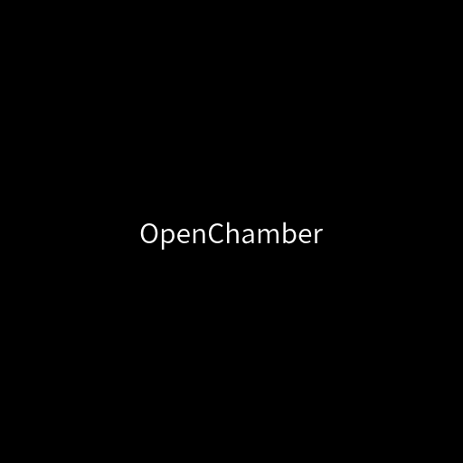

# OpenChamber Launcher

<p align="center">
  
</p>

<p align="center">
  <a href="https://www.npmjs.com/package/openchamber-desktop"></a>
  <a href="https://github.com/aencyorganization/openchamber-desktop/releases"></a>
  <a href="LICENSE"></a>
</p>

<p align="center">
  <b>Desktop launcher for OpenChamber</b><br>
  Cross-platform • Auto-detection • Minimalist
</p>

---

## 🚀 Quick Start

### Install & Run (30 seconds)

```bash
# Via npm/bun (recommended)
bun install -g openchamber-desktop
openchamber-desktop

# Or download AppImage (Linux)
wget https://github.com/aencyorganization/openchamber-desktop/releases/latest/download/OpenChamber-Launcher-x86_64.AppImage
chmod +x OpenChamber-Launcher-x86_64.AppImage
./OpenChamber-Launcher-x86_64.AppImage
```

---

## 📋 Table of Contents

- [Features](#-features)
- [Requirements](#-requirements)
- [Installation](#-installation)
- [Development](#-development)
- [Keyboard Shortcuts](#-keyboard-shortcuts)
- [Project Structure](#-project-structure)
- [Credits](#-credits)
- [License](#-license)

---

## ✨ Features

| Feature | Description |
|---------|-------------|
| 🔍 **Auto-Detection** | Automatically finds OpenChamber installation |
| 🎯 **Smart Port Detection** | Detects which port OpenChamber is using |
| 🔒 **Secure Container** | Sandboxed iframe with full system access |
| 🧹 **Auto-Cleanup** | Kills all processes on exit |
| 🖥️ **Cross-Platform** | Linux, macOS, Windows support |
| 📦 **Multiple Formats** | AppImage, npm, direct binary |
| ⌨️ **Keyboard Shortcuts** | Fullscreen (F11), Zoom (Ctrl +/-) |

---

## 📦 Requirements

### System
- **OS**: Linux (x64/arm64), macOS (Intel/Apple Silicon), Windows (x64)
- **RAM**: 512 MB minimum
- **Disk**: 50 MB

### Software
- [OpenChamber](https://github.com/btriapitsyn/openchamber) must be installed

**Install OpenChamber:**
```bash
# Quick install
curl -fsSL https://raw.githubusercontent.com/btriapitsyn/openchamber/main/scripts/install.sh | bash

# Or via package manager
bun add -g @openchamber/web
npm install -g @openchamber/web
```

---

## 🚀 Installation

### Option 1: Package Manager (Recommended)

```bash
# Bun
bun install -g openchamber-desktop

# npm
npm install -g openchamber-desktop

# pnpm
pnpm add -g openchamber-desktop

# Run
openchamber-desktop
# or shorthand
ocd
```

### Option 2: AppImage (Linux)

```bash
# Download
wget https://github.com/aencyorganization/openchamber-desktop/releases/latest/download/OpenChamber-Launcher-x86_64.AppImage

# Make executable
chmod +x OpenChamber-Launcher-x86_64.AppImage

# Run
./OpenChamber-Launcher-x86_64.AppImage

# Optional: Move to applications folder
mv OpenChamber-Launcher-x86_64.AppImage ~/.local/bin/openchamber-desktop
```

### Option 3: Direct Download

Download from [GitHub Releases](https://github.com/aencyorganization/openchamber-desktop/releases):

| Platform | File |
|----------|------|
| Linux x64 | `openchamber-launcher-linux_x64` |
| Linux ARM64 | `openchamber-launcher-linux_arm64` |
| macOS Intel | `openchamber-launcher-mac_x64` |
| macOS Apple Silicon | `openchamber-launcher-mac_arm64` |
| Windows | `openchamber-launcher-win_x64.exe` |

---

## 🛠️ Development

### Setup

```bash
# Clone repository
git clone https://github.com/aencyorganization/openchamber-desktop.git
cd openchamber-desktop

# Install dependencies
bun install

# Download Neutralino binaries
bun run update
```

### Commands

```bash
# Development mode (hot-reload)
bun run dev

# Build for all platforms
bun run build

# Build release version
bun run build:release

# Build AppImage (Linux only)
bun run build:appimage
```

---

## ⌨️ Keyboard Shortcuts

| Shortcut | Action |
|----------|--------|
| `F11` | Toggle fullscreen |
| `Ctrl/Cmd + +` | Zoom in |
| `Ctrl/Cmd + -` | Zoom out |
| `Ctrl/Cmd + 0` | Reset zoom |

---

## 📁 Project Structure

```
openchamber-desktop/
├── 📁 assets/              # Images, icons
├── 📁 bin/                 # Compiled binaries
│   ├── cli.js             # CLI entry point
│   ├── neutralino-*       # Platform binaries
│   └── ...
├── 📁 config/              # Configuration files
│   └── npm-package.json   # npm package config
├── 📁 docs/                # Documentation
│   ├── CHANGELOG.md
│   ├── CONTRIBUTING.md
│   ├── CODE_OF_CONDUCT.md
│   ├── SECURITY.md
│   └── PUBLISHING.md
├── 📁 resources/           # App resources
│   ├── index.html         # Main UI
│   ├── styles/
│   └── js/
├── 📁 scripts/             # Build & utility scripts
│   ├── build/
│   │   ├── build-appimage.js
│   │   └── publish-npm.sh
│   └── postinstall.js
├── 📁 .github/             # GitHub templates & workflows
│   ├── workflows/
│   └── ISSUE_TEMPLATE/
├── 📄 package.json         # Main package config
├── 📄 neutralino.config.json  # App configuration
├── 📄 README.md            # This file
└── 📄 LICENSE              # GPL-3.0
```

---

## 🙏 Credits

### Original Projects

- **[OpenChamber](https://github.com/btriapitsyn/openchamber)** - Desktop interface for OpenCode
  - Created by [Bogdan Triapitsyn](https://github.com/btriapitsyn)
  - Repository: https://github.com/btriapitsyn/openchamber

- **[OpenCode](https://opencode.ai)** - AI coding assistant for the terminal
  - Developed by [Anomaly Innovations](https://anomalyinnovations.com)
  - Website: https://opencode.ai

### Technologies

- [NeutralinoJS](https://neutralino.js.org/) - Cross-platform desktop framework
- [neutralino-appimage-bundler](https://github.com/krypt0nn/neutralino-appimage-bundler) - AppImage packaging

---

## 📄 License

This project is licensed under the **GNU General Public License v3.0 (GPL-3.0)**.

See [LICENSE](LICENSE) for details.

**Disclaimer**: This is an independent project and is not officially affiliated with OpenCode or Anomaly Innovations.

---

<p align="center">
  Made with ❤️ by <a href="https://github.com/aencyorganization">Aency Organization</a>
</p>
